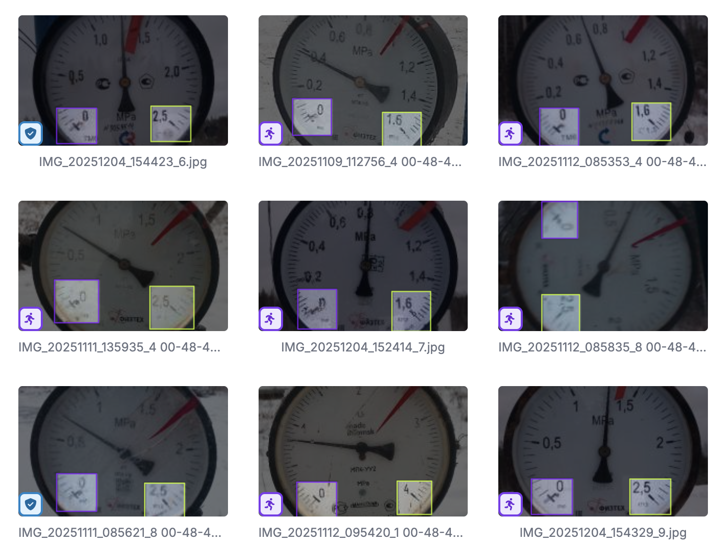
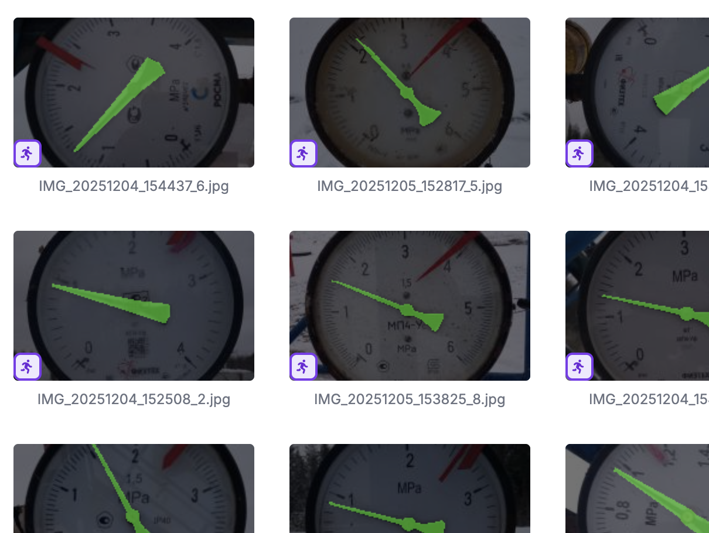
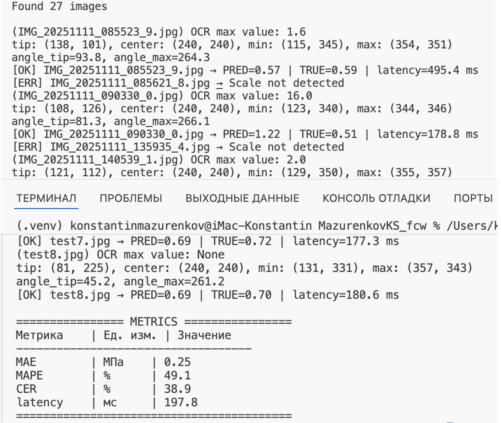
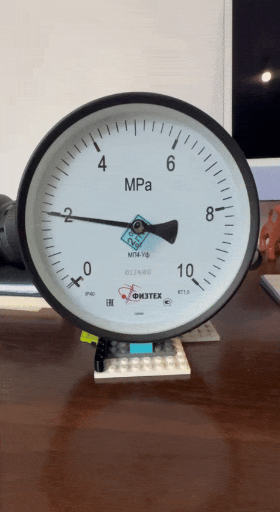

# MazurenkovKS_mproject_v1.0
My master's project

Проект магистерской работы студента ТГУ по программе "Компьютерное зрение и нейронные сети". 

При эксплуатации месторождений углеводородного сырья на добывающих и нагнетательных скважинах установлены приборы (устройства) для измерения давления на устье скважин. Они предназначены для наблюдения за параметрами эксплуатации скважин, для предупреждения аварийных ситуаций и снижение рисков негативного воздействия на окружающую среду. Периодичность и качество переданных значений с данных приборов служит для оценки эффективности мероприятий и для регулирования процесса разработки месторождений. В качестве приборов и устройств используются аналоговые манометры и датчики давления. Однако, в силу различных причин повсеместно используются аналоговые манометры или преобразователя давления совместно с манометром для визуализации показаний. При этом в любом случае считывание показаний с манометров осуществляется оператором визуально с ручным вводом данных в мобильное приложение, а количество таких операций может достигать ввода 150 и более единиц информации за смену на одного оператора. В ряде случаев, из-за человеческого фактора, данные могут быть считаны некорректно или занесены с ошибками, что приводит к неверной оценке эффективности мероприятий и может вызвать аварийные ситуации. В связи с этим возникает необходимость в создании системы, способной детектировать избыточное давление на устье скважин с использованием доступных и подручных средств, таких как видеокамера смартфона.

**Цель проекта:** автоматическая фиксация давления с аналогового манометра.

## Структура проекта  

```sh
pressure_gauge/
│
├── app/
│   ├── main.py
│   │
│   ├── main_order.py                  # для отчета         
│   │
│   ├── core/                   
│   │   └── pipeline.py
│   │   
│   ├── detectors/
│   │   ├── meter_detector.py
│   │   └── yolo_detect.py
│   │
│   ├── segmenters/
│   │   └── needle_seg.py
│   │
│   ├── ocr/
│   │   └── scale_ocr.py
│   │
│   ├── geometry/
│   │   └── geometry.py
│   │
│   ├── image_test/                    # для демонстрации системы MVP
│   │   ├── test.jpg
│   │   ├── ...
│   │   └── test8.jpg
│   │
# │   ├── patterns/               
# │   │   ├── factory.py
# │   │   └── observer.py
│   │
│   ├── order_test/                     # для отчета  
│   │   ├── IMG_20251111_085523_9.jpg
│   │   ├── ...
│   │   └── IMG_20251116_092501_2.jpg
│   │
│   └── models/                 
│       └── (веса моделей)
│
# ├── tests/
│
├── docs/
│   ├── presentation.pptx
│   └── project report.docx
│
├── diagrams/
│   ├── use_case_diagram.puml
│   ├── component_diagram.puml
│   └── deployment_diagram.puml
│
├── demo/
│   └── demo files
│
├── install/
│   └── README.md│
│
├── README.md
├── LICENSE
├── CHANGELOG.md
├── requirements.txt
└── .gitignore
```

## Демонстрация MVP с угловым методом:


## Разметка для классификации шкалы (минимум и максимум):


## Сегментация стрелки манометра:


## Метрики MVP:


## Видеоряд со стенда:



## Requirements:
```certifi==2026.1.4
charset-normalizer==3.4.4
contourpy==1.3.2
cycler==0.12.1
filelock==3.20.2
fonttools==4.61.1
fsspec==2025.12.0
idna==3.11
Jinja2==3.1.6
kiwisolver==1.4.9
MarkupSafe==3.0.3
matplotlib==3.10.8
mpmath==1.3.0
networkx==3.4.2
numpy==1.26.4
opencv-python==4.11.0.86
packaging==25.0
pandas==2.3.3
pillow==12.1.0
psutil==7.2.1
py-cpuinfo==9.0.0
pyparsing==3.3.1
pytesseract==0.3.13
python-dateutil==2.9.0.post0
pytz==2025.2
PyYAML==6.0.3
requests==2.32.5
scipy==1.15.3
seaborn==0.13.2
six==1.17.0
sympy==1.14.0
thop==0.1.1.post2209072238
torch==2.1.2
torchvision==0.16.2
tqdm==4.67.1
typing_extensions==4.15.0
tzdata==2025.3
ultralytics==8.0.224
urllib3==2.6.3
```

## License
This project is licensed under the MIT License - see the LICENSE file for details.


### Отчет: docs/project report.docx
### Презентация: docs/presentation.pptx